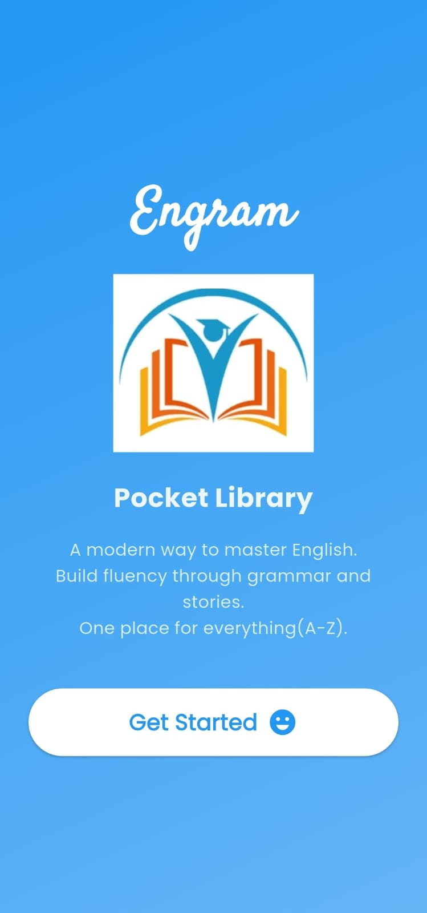
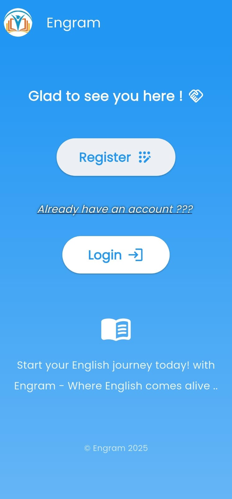
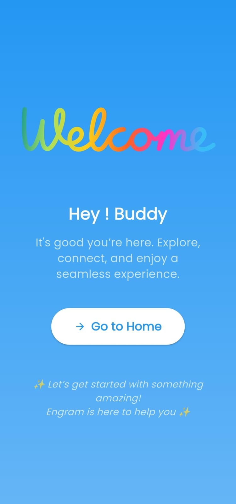
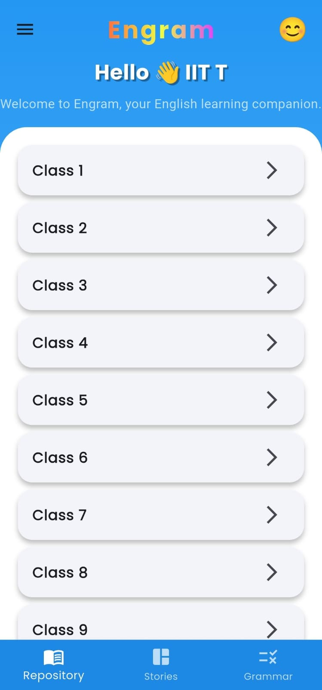
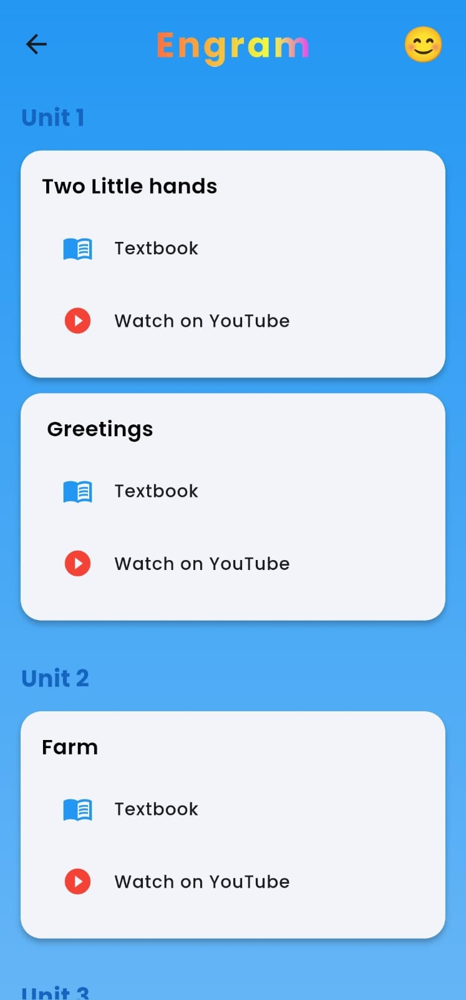
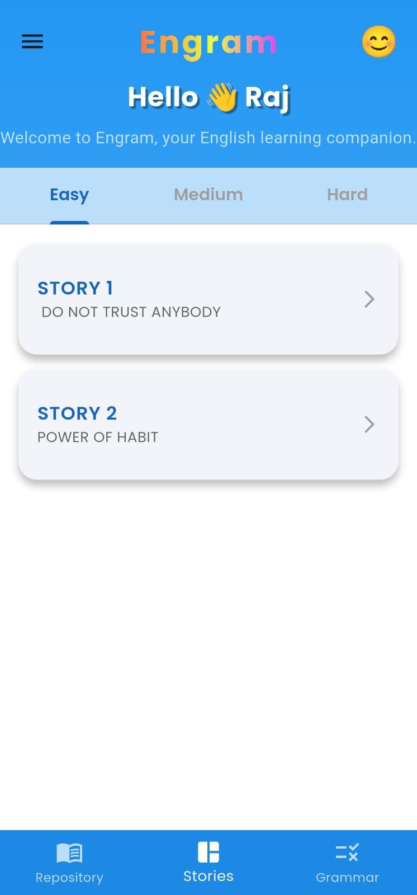
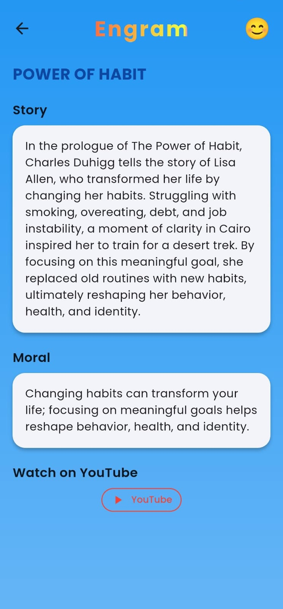
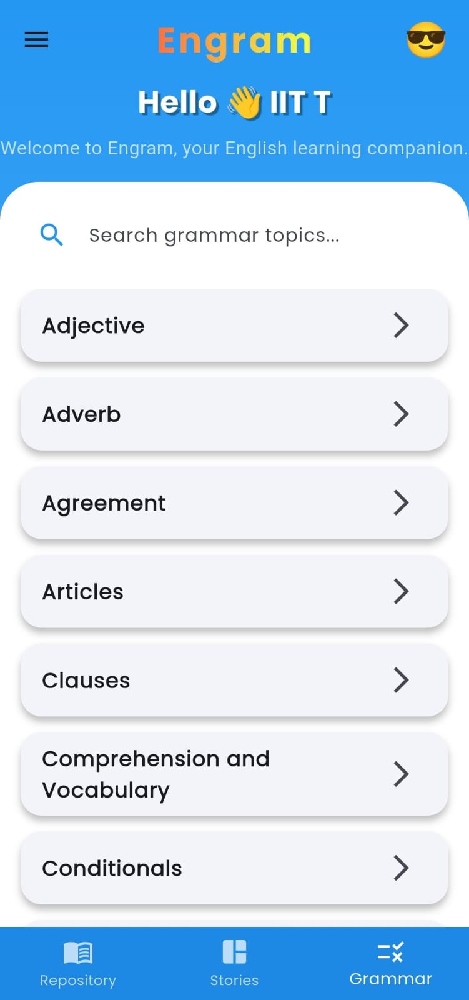
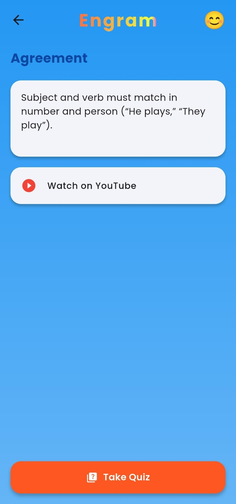
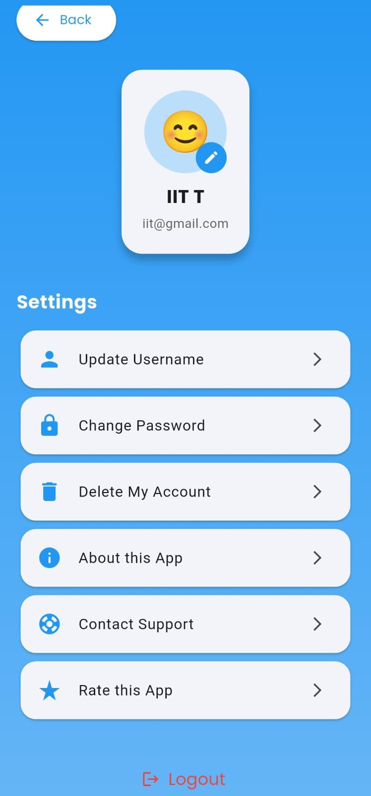

# 📘 Engram – Quality Education App

---

## 👥 Team Members
- Anvesh        -CS24B016
- Akshaya Sri   -CS24B035 
- Sreeja Raj    -CS24B030
- Dakshayani    -CS21B016 
- Vishnu Bachu  -CS24B004
- Mann Kamble   -CS24B023 

---

## 🛠 Languages / Tools Used
- *Languages & Frameworks:* Dart , Flutter 
- *Backend :* Firebase
- *Database :* Firestore  
- *Version Control:* GitHub

---

## 📲 Apps & Platforms Used
- *YouTube* (Learning resources & video links)  
- *Flutter* (App development framework)  
- *Firebase* (Backend & authentication)  
- *Android Studio* (Development & APK build)  
- *Chatgpt*(Code enhancement & debugging)
- *GitBash*(To push project to git hub)
  
---

## 👩‍💻 Contributions
- *Frontend Development:* Anvesh, Vishnu, Mann  
- *Backend Development:* Anvesh, Akshaya, Sreeja, Dakshayani  
- *Resources Collection (YouTube links, stories, textbooks, grammar topics):* All team members  

---

## 📖 About the App
Engram is a *free English learning app* designed to make education accessible to everyone, especially students from poor and rural backgrounds.  

- Supports *UN Sustainable Development Goal (SDG 4): Quality Education*.  
- Provides *easy access* to textbooks, grammar lessons, quizzes, and stories.  
- Helps students *learn English interactively* with the support of videos and resources.  
- Aims to *bridge the gap* for students who cannot afford costly tuition or books.
- Mostly for the ones who are getting tired of searching wanted links. 

Engram is a small step toward ensuring *inclusive and equitable quality education* for all.  

---

## 📌 How to Use the App

Below are the steps to use the app. 

### Step 1: Download the app using .apk file
 (https://github.com/Jamianvesh/Engram/releases/download/v1.0.0/Engram.apk)

### Step 2: Open the app. You see the description of app like this :
 

### Step 3 : When you enter "get started" button, you can either *Login* or *Register* for a new account. : 
 

### Step 4: You will see something like this after successfully login. Click on "Go to Home", to get all resources.
 

### Step 5: Home Screen  
In the home page shows three main options at the bottom **Repository**, **Grammar**, and **Stories**.  
Here it is on repository option so you'll see all the classes from 1-12 where you can choose one of the classes to study.

 

### Step 6: Repository Section  
Navigate through **Classes -> units(chapters)**. Each chapter contains:  
- Textbook link (PDFs)  
- YouTube video explanations
 

### Step 7: Stories Section  
Stories section is again divided into **Easy, Medium, and Hard** categories.

 

### Step 8:
Each level has **stories with morals** to learn English through reading.
On clicking a story you'll see like this.

 
 
### Step 9: Grammar Section  
When you go to grammar section,you get a page that
Covers all grammar topics such as *Nouns, Pronouns, Verbs, etc.* 

 
 

### Step 10 : On clicking any one topic(let's say "Agreement").
 
Each topic includes:
- Title, and Description  
- YouTube video link  
- Quiz questions 

### Step 11: Profile Section  
  
In the profile, you can:
- Update Username  
- Change password  
- Delete My account
- About this app  
- Contact support
- Rate the app 
- Logout  
  
---

## 🎯 Importance of Engram
- *Free and Accessible Education* – No student is left behind due to lack of resources.  
- *Helps Poor & Rural Students* – Provides learning material without cost.  
- *Self-Paced Learning* – Students can learn English at their own speed.
- *fluent in English* - Students can have a habit of reading stories which will improve their fluency.
- *Quality Education for All* – Directly supports SDG 4.  

---

## 🙏 Acknowledgement
We, the Engram team, would like to sincerely thank our faculty and mentors for their valuable guidance throughout the development of this project.  
We also acknowledge the contributions of every team member who worked with dedication on both the frontend and backend, and collected resources to make this app possible.  

Our motivation behind Engram was to build something meaningful that can support students in their learning journey.  
This project stands as a small step toward *bridging educational gaps* and promoting *quality education for all*.
